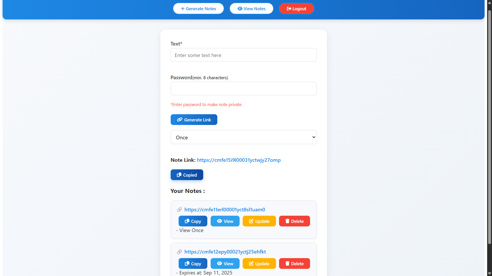

# 📝 Make Notes

A secure and minimal **Notes Application** built with the **MEAN Stack (MongoDB, Express, Angular, Node.js)**.  
It allows users to **sign up, log in, and create, view, edit, and delete notes** — with JWT authentication and refresh token mechanism.  

🚀 Deployed live: [Make Notes](https://make-notes-iota.vercel.app/)  
🔗 Backend API: [Render Server](https://make-notes-qyc8.onrender.com)

---

## ✨ Features
- 🔐 **User Authentication** (Signup & Login with JWT)
- 📝 **Create, Read, Update, Delete Notes**
- 💾 **Secure Token Management** (Access & Refresh Tokens)
- 🎨 **Modern Angular UI** with responsive design
- ☁️ **Full Deployment**: Frontend on Vercel, Backend on Render

---

## 📸 Screenshots
| Login Page | Notes Dashboard |
|------------|-----------------|
|  |  |

---

## 📽 Demo Video
👉 [Watch the Demo](https://youtu.be/demo-video-link)  

*(Upload your demo to YouTube as unlisted, then put the link here. Alternatively, add a `.gif` preview inside `/assets` and embed it.)*

---

## 🛠 Tech Stack
- **Frontend**: Angular, TypeScript
- **Backend**: Node.js, Express
- **Database**: MongoDB (Atlas)
- **Authentication**: JWT + Refresh Tokens
- **Deployment**: Vercel (Client) + Render (Server)

---

## ⚙️ Installation (Local Development)

```bash
# Clone the repository
git clone https://github.com/Chiragmanral/Make-Notes.git
cd Make-Notes

# Setup Backend
cd server
npm install
npm start

# Setup Frontend
cd ../client
npm install
ng serve -o

```
Now your frontend will be running on **http://localhost:4200** in your browser, and your backend API will be running on **http://localhost:5000**, but your frontend will be hitting the live API by default. So, if you want to run this project fully on your local system then replace all the **live API link(https://make-notes-qyc8.onrender.com)** to **http://localhost:5000** in your frontend code, to run this project fully locally on your system.
**Bonus tip** :- You can use nodemon server.js instead of npm start(node server.js) to run your backend locally at the time of development.
